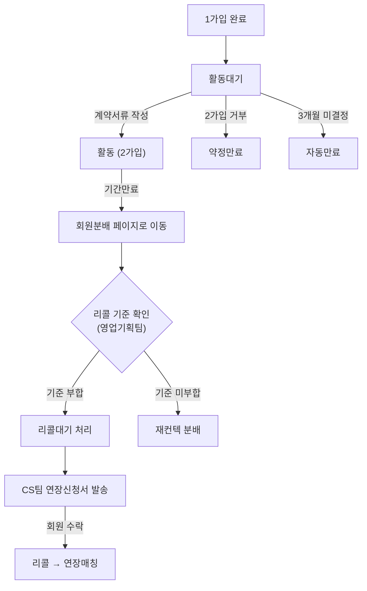

# 회원분배 → 리콜대기 처리 기능 설계

## 📋 프로세스 정리 (수정 반영)



## 🎯 핵심 요구사항

> **현재 문제**: 2가입 종료 → 회원분배 페이지에 도착했을 때, 미팅횟수/리콜 기준을 확인할 수 없어 정회원 페이지로 다시 이동해야 함
>
> **개선**: 회원분배 `기간만료(재컨텍)` 탭에서 **리콜 기준 정보를 표시**하고, **리콜대기 처리 버튼**을 추가

## 🔧 구현 설계

### 1. `기간만료(재컨텍)` 탭 테이블 컬럼 확장

| 현재 컬럼 | 추가/변경 컬럼 |
|-----------|--------------|
| No, 이름, 성별, 나이 | (유지) |
| 연락처, 등록일 | (유지) |
| 과거 프로그램 | (유지) |
| 미팅 횟수 | **⭐ 계약기간 대비 미팅 부족 여부 표시** |
| 총 결제액 | (유지) |
| 클레임 | (유지) |
| — | **🆕 리콜기준** (부합/미부합 뱃지) |
| — | **🆕 처리** (리콜대기 처리 버튼) |

### 2. 리콜 기준 자동 판별 로직

```
리콜 기준 = 계약기간(월) - 미팅횟수 > 0
→ 미팅이 부족한 회원 = 리콜 대상
```

- ✅ 부합: 녹색 뱃지 `리콜대상`
- ❌ 미부합: 회색 `해당없음`

### 3. 액션 버튼 추가

- **개별 처리**: 각 행 오른쪽에 `[리콜대기]` 버튼
- **일괄 처리**: 상단에 `리콜대기 일괄처리` 버튼 (체크박스 선택 후)

### 4. 리콜대기 처리 시 동작

1. 정회원 Mock 데이터에서 해당 회원 상태를 `리콜대기`로 변경
2. 히스토리에 "기간만료→리콜대기" 이력 자동 기록
3. 회원분배 리스트에서 해당 회원 제거
4. Toast 알림: "○○○ 회원이 리콜대기 상태로 전환되었습니다"

## 📁 수정 대상 파일

| 파일 | 수정 내용 |
|------|----------|
| `pages/management/distribute.js` | 재컨텍 탭에 리콜기준 컬럼/버튼 추가, 리콜대기 처리 핸들러 |
| `src/mock/regulars.js` | 2가입 만료 후 회원분배로 넘어온 데이터 연동 |
