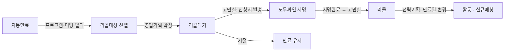

# 리콜 서비스 개발 분석서

> **작성일**: 2026-06-05 | **상태**: ✅ 2단계 개발 완료 | 모두싸인 API 연동 Mock 구현

---

## 1. 정책 요약

| 항목 | 내용 |
|------|------|
| **대상** | 2가입 계약기간 내 만남 횟수 부족 회원 (월 1회 기준) |
| **제외 대상** | 전문직, 프로모션(기타), 실버(에메랄드) 일반, 플러스 가입 회원 |
| **연장 산정** | 계약기간(월) - 실제 만남 횟수 = 연장 기간(월) |
| **시행일** | 2025년 6월 1일~ |

---

## 2. 신규 회원상태 정의

현재 정회원 상태 목록(`constants.js`)에 **2개 상태 추가** 필요:

```diff
 export const REGULAR_STATUSES = [
   '신규', '인증중', '활동대기', '활동',
   '임시교제', '교제', '외부교제',
   '약정보류', '임시보류', '장기보류', '강제보류',
   '약정만료', '자동만료', '만료', '기타만료',
-  '탈회진행', '탈회', '결혼예정', '성혼',
+  '탈회진행', '탈회', '결혼예정', '성혼',
+  '리콜대기', '리콜',
 ];
```

### 상태 전이 흐름



| 상태 | 설명 | 처리 부서 | 배지 색상 |
|------|------|-----------|-----------|
| **리콜대기** | 대상 선별 완료, 고만실에서 통화·신청서 발송 단계 | 영업기획→고만실 | `amber` |
| **리콜** | 서명 완료, 전략기획에서 만료일 변경·매칭 시작 대기 | 고만실→전략기획 | `blue` |

---

## 3. 영향 범위 분석

### 3-1. 수정 대상 파일

| 파일 | 수정 내용 | 우선순위 |
|------|----------|----------|
| `src/config/constants.js` | `REGULAR_STATUSES`에 '리콜대기', '리콜' 추가 | 🔴 필수 |
| `src/utils/formatters.js` | `statusBadge()` 맵에 리콜대기→amber, 리콜→blue 추가 | 🔴 필수 |
| `pages/regular/list.js` | 정회원 리스트 필터 드롭다운에 리콜대기/리콜 옵션 추가 | 🔴 필수 |
| `pages/regular/detail.js` | 상세 화면 상태 전이 버튼에 리콜대기/리콜 전환 추가 | 🔴 필수 |
| `pages/regular/change-history.js` | 회원상태 변경 탭에서 리콜 관련 변경이력 표시 | 🟡 권장 |
| `src/mock/regulars.js` | Mock 데이터에 리콜대기/리콜 상태 회원 추가 | 🟡 권장 |

### 3-2. 신규 개발 대상

| 기능 | 설명 | 우선순위 |
|------|------|----------|
| **리콜 대상 자동 선별 로직** | 만료 회원 중 조건(프로그램, 미팅 횟수) 기반 필터링 | 🔴 핵심 |
| **기간연장 산정 계산기** | 계약기간 - 만남횟수 = 연장기간 자동계산 UI | 🔴 핵심 |
| **기간연장 신청서 전자발송** | 이노페이 연동 또는 별도 전자서명 모듈 | 🟡 2단계 |
| **리콜 회원 전용 대시보드** | 리콜대기/리콜 현황 요약 + 리스트 | 🟡 권장 |

---

## 4. 리콜 대상 선별 로직 (핵심)

### 4-1. 자동 선별 조건

```
리콜 대상 = 만료 회원 AND 아래 조건 모두 충족:
  ① 프로그램 ≠ '전문직', '기타', '실버(에메랄드) 일반', '플러스'
  ② 실제 만남 횟수 < 계약기간(월)
  ③ 제외 조건에 해당하지 않음
```

### 4-2. 제외 조건 (서비스 충분 제공)

```
제외 대상 = 아래 중 하나라도 해당:
  ① 프로필 제공 평균 월 2회 이상 충족
  ② 소통 내역 메모 다수 기록
  ③ 프로필 거절률 ≥ 80% (발송 대비)
  ④ 컴플레인 ≥ 5회 (상습 요청)
```

### 4-3. 기간연장 산정 공식

```javascript
function calcExtensionMonths(contractMonths, meetingCount) {
  // 기본 공식: 계약기간 - 만남횟수
  let extension = contractMonths - meetingCount;
  
  // 최소 0개월
  if (extension < 0) extension = 0;
  
  // 특수 케이스: 만남 횟수 충족했지만 만료 6개월 전부터 만남 없음
  // → 1개월 연장
  // (이 케이스는 별도 날짜 비교 로직 필요)
  
  return extension;
}

// 예시
// 12개월 계약, 3회 만남 → 9개월 연장
// 12개월 계약, 9회 만남 → 3개월 연장
// 12개월 계약, 12회 만남 → 0개월 (단, 6개월 미만남 시 1개월)
```

---

## 5. 업무 프로세스 → 인트라넷 기능 매핑 (확정)

| 단계 | 업무 | 담당 | 인트라넷 기능 | 구현 |
|------|------|------|------------|:---:|
| ① | 자동만료 필터 | 시스템 | 만료 회원 자동 추출 | ✅ |
| ② | 프로그램 기준 필터 | 시스템 | 제외 프로그램 자동 필터링 | ✅ |
| ③ | 미팅횟수 확인·선정기준 확인 | 영업기획 | 연장기간 자동 산정 표시 | ✅ |
| ④ | 리콜대기 상태 처리 | 영업기획 | 체크박스 선택 → 일괄 상태 변경 | ✅ |
| ⑤ | 통화 + 기간연장신청서 발송 | 고만실 | **모두싸인 API** 신청서 발송 버튼 | ✅ |
| ⑥ | 전자서명 완료 확인 | 고만실 | 서명확인 버튼 (Webhook 연동 예정) | ✅ |
| ⑦ | 리콜 상태 전환 | 고만실 | 서명완료 후 리콜 전환 버튼 | ✅ |
| ⑧ | 만료일 변경 + 매칭 시작 | 전략기획 | 날짜 직접 입력 → 승인·활동전환 | ✅ |

---

## 6. 전자서류 발송 체계 (모두싸인 API)

| 서류 | 발송 시점 | 연동 | 상태 |
|------|----------|------|:---:|
| **이노페이 (결제)** | 2가입 시 | 이노페이 API | 🟡 예정 |
| **트리니티 바우처 수령확인증** | 트리니티 등록 시 | 모두싸인 | 🟡 예정 |
| **탈회 신청서** | 탈회 요청 시 | 모두싸인 | 🟡 예정 |
| **특별기간연장 신청서** | 리콜대기 단계 | 모두싸인 | ✅ Mock 구현 |

> [!IMPORTANT]
> 모두싸인 API 실제 연동 시 필요: **API KEY**, **템플릿 ID**, **Webhook URL**
> 현재는 Mock 응답으로 구현되어 있으며, API KEY 확보 후 `ModusignService` 내 TODO 주석을 실제 코드로 교체합니다.

---

## 7. 권한별 접근 범위

| 역할 | 리콜대기 설정 | 리콜 전환 | 기간연장 실행 | 리콜→활동 |
|------|:---:|:---:|:---:|:---:|
| **팀장(director)** | ✅ | ✅ | ✅ | ✅ |
| **영업기획** | ✅ | ❌ | ❌ | ❌ |
| **고객만족** | ❌ | ✅ | ❌ | ❌ |
| **전략기획** | ❌ | ❌ | ✅ | ❌ |
| **매칭센터** | ❌ | ❌ | ❌ | ✅ |
| **매니저(manager)** | ❌ | ❌ | ❌ | ❌ |

> [!NOTE]
> 현재 roles.js에 위 부서 구분이 없음. 일단 director/manager 2단계로 처리하고,
> 부서별 세분화는 추후 조직 구조 확정 후 반영.

---

## 8. 개발 우선순위 제안

### 1단계 (즉시 반영 가능)
1. `constants.js` — 리콜대기/리콜 상태 추가
2. `formatters.js` — 배지 색상 매핑 추가
3. `pages/regular/list.js` — 필터 드롭다운 반영
4. `pages/regular/detail.js` — 상태 전이 버튼 추가
5. Mock 데이터에 리콜 상태 회원 추가

### 2단계 (UI/UX 완성)
6. 리콜 대상 자동 선별 화면 (만료 회원 필터 + 연장기간 자동 계산)
7. 기간연장 신청서 발송 버튼 + 발송 이력 기록
8. 변경이력 탭에 리콜 관련 로그 자동 기록

### 3단계 (외부 연동)
9. 모두싸인 API 실제 연동 (API KEY + 템플릿 설정)
10. 이노페이 결제 API 연동
11. Webhook 연동 (서명 완료 자동 감지)

---

## 9. 논의 사항 (확정)

| # | 항목 | 결정 | 상태 |
|---|------|------|:---:|
| 1 | 리콜대기/리콜 회원 UI 배치 | **기존 정회원 리스트에 필터로 통합** | ✅ 확정 |
| 2 | 기간연장 실행 방식 | **만료일 직접 수정** (별도 테이블 없음) | ✅ 확정 |
| 3 | 매칭팀장 삼진아웃 제도 관리 | **협의 필요** (인트라넷 관리 범위 미정) | 🟡 협의 |
| 4 | 리콜 만료 수당 계산·집계 | **협의 필요** (급여 시스템 연계 여부 미정) | 🟡 협의 |
| 5 | 전자서류 발송 시스템 | **모두싸인 API 확정** (이노페이는 결제 전용) | ✅ 확정 |
