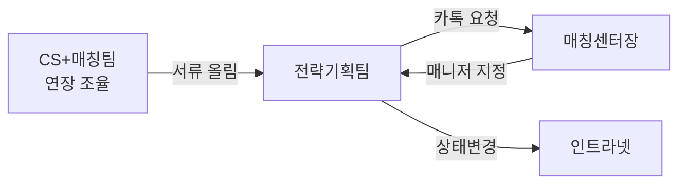
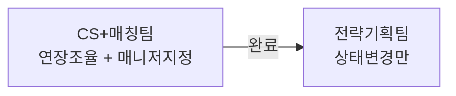
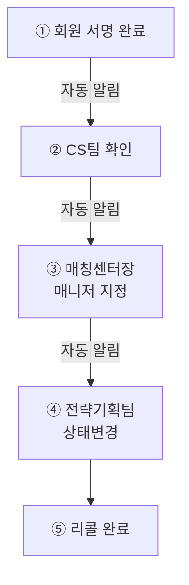

# 리콜 워크플로우 분석 — 담당부서 피드백 기반

## 1. 현행 프로세스 (AS-IS) 문제점

### 핵심 병목

| 구간 | 현재 방식 | 문제 |
|------|----------|------|
| 연장 조율 → 전략기획 | 서류 수동 전달 | 전달 누락/지연 가능 |
| 전략기획 → 매칭센터장 | **카카오톡 별도 요청** | 시스템 외부 소통, 추적 불가 |
| 매니저 지정 → 상태변경 | 수동 확인 후 변경 | 대기 시간 발생 |

> [!IMPORTANT]
> **전략기획팀은 중간 전달자 역할만 하고 있음** — 연장 조건에 개입하지 않고, 매니저 지정도 매칭센터장에게 다시 요청. 이 구간을 자동화하면 업무 효율이 크게 개선됨.

---

## 2. 피드백에서 제안된 두 가지 방향

### A안: 사전 통합 — CS+매칭 협의 시 매니저도 함께 지정

- **장점**: 가장 단순. 전략기획팀의 중간 전달 역할 제거
- **단점**: 매칭센터장의 순번 관리 체계와 충돌 가능성

### B안: 알림 기반 원스톱 워크플로우

- **장점**: 각 담당자가 자기 단계만 처리, 자동으로 다음 단계 트리거
- **단점**: 알림 시스템 구축 필요

---

## 3. 분석 결론

### B안이 최적 — 이유:

| 관점 | 분석 |
|------|------|
| **현실성** | 매칭센터장의 순번 관리를 유지하면서 자동화 가능 |
| **확장성** | 알림 시스템은 리콜뿐 아니라 다른 업무에도 활용 가능 |
| **추적성** | 각 단계별 처리일시/담당자가 자동 기록 |
| **업무 속도** | 카톡 대기 → 인트라넷 알림으로 즉시 인지 |

### 구현 시 필요한 것

| 항목 | 설명 |
|------|------|
| **알림 시스템** | 인트라넷 내 알림센터 (🔔 벨 아이콘) |
| **알림 타입** | 리콜 서명완료, 매니저 지정요청, 상태변경요청 |
| **역할별 라우팅** | CS → 매칭센터장 → 전략기획 순서로 자동 전달 |
| **회원상세 통합** | 현재 단계가 회원상세에 표시되고, 해당 담당자만 액션 가능 |

---

## 4. 제안 — 단계적 구현

### Phase 1 (지금 가능)
- 별도 리콜관리 페이지 제거
- 회원상세에 리콜 섹션 통합 (발송 버튼, 진행상태 표시)
- 상태변경 시 이력 자동 기록

### Phase 2 (알림 인프라 구축 후)
- 🔔 알림센터 UI 구현
- 단계별 자동 알림 발송 (인트라넷 내부)
- 알림 클릭 → 해당 회원상세로 바로 이동

### Phase 3 (외부 연동)
- 카카오 알림톡 / 슬랙 연동 (선택)
- 모두싸인 Webhook으로 서명완료 자동 감지

---

## 5. 결정 필요 사항

> [!WARNING]
> 아래 항목들은 구현 전 확정이 필요합니다.

1. **Phase 1만 먼저 진행할지**, Phase 2까지 한번에 설계할지?
2. **알림 채널** — 인트라넷 내부 알림만? 카카오/슬랙 외부 연동도?
3. **연장신청서 발송 시 날짜 설정** — 연장기간(변경된 기간)은 어떤 단계에서, 어떤 부서에서 설정하는가? (CS팀 조율 시점 / 전략기획팀 발송 시점 / 기타)
4. **프로그램 변경 프로세스** — 프로그램 변경이 가능한 시점은? 변경 프로세스는 어떻게 되는가? (예: 프로그램 변경요청 → 계약서 재작성 → 서명 → 추가금 결제, 담당부서: 상담팀, 최종 서류 확인 후 회원정보 수정: 인증팀)
5. **프로그램 변경 시 기간 정책** — 프로그램을 변경한 경우 계약기간은 변경되지 않고 등급만 변경되는가?
6. **지사 변경 시 회원 아이디 정책** — 최초 가입 시 지역구분에 따라 아이디가 생성되는데, 지사 변경 시 아이디는 기존대로 유지되는가?
7. **리콜대기 상태 연장기간 설정** — 리콜대기 상태에서 연장기간 설정은 어느 부서에서, 어떤 화면에서 진행하는가?
8. **약정만료 후 상태전환 프로세스** — 1가입 완료 시 약정만료로 자동전환 → 상담매니저가 회원상담 후 재가입 의사가 있는 회원만 활동대기로 변경 → [계약정보확인]·[문자발송] 버튼 발송, 이 프로세스가 맞는가?
9. **미가입 자동만료 정책** — 약정만료 이후 3개월간 미가입 시 자동만료로 처리되는 것이 맞는가?
10. **자동만료 후 재등록 시 이전 기록** — 자동만료된 회원이 다시 회원DB에 등록된 경우, 이전 활동/계약 기록을 연동(유지)할 필요가 있는가?
