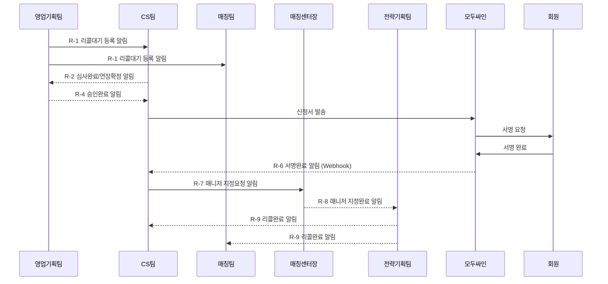

# 알림 시스템 설계 명세서

> 향후 구현을 위한 알림 항목 정리. 현재는 화면설계만 진행하며, 알림 시스템은 추후 개발.

---

## 1. 리콜 프로세스 알림

| # | 트리거 이벤트 | 발신 | 수신 | 알림 내용 | 우선순위 |
|---|-------------|------|------|----------|---------|
| R-1 | 리콜대기 등록 완료 | 영업기획팀 | CS팀, 매칭팀 | `[리콜대기] OOO 회원이 리콜대기로 등록되었습니다. 심사를 진행해주세요.` | 높음 |
| R-2 | 심사완료 (연장확정) | CS팀 | 영업기획팀 | `[승인요청] OOO 회원 연장확정 (X개월, 만료일: YYYY-MM-DD). 승인을 진행해주세요.` | 높음 |
| R-3 | 심사불가 처리 | CS팀 | 영업기획팀 | `[리콜불가] OOO 회원 리콜 불가 처리. 사유: ~~~` | 보통 |
| R-4 | 영업기획팀 승인완료 | 영업기획팀 | CS팀 | `[승인완료] OOO 회원 연장이 승인되었습니다. 신청서를 발송해주세요.` | 높음 |
| R-5 | 신청서 발송 완료 | CS팀 | 영업기획팀 | `[발송완료] OOO 회원에게 기간연장 신청서가 발송되었습니다.` | 보통 |
| R-6 | 회원 서명 완료 | 모두싸인(자동) | CS팀 | `[서명완료] OOO 회원이 기간연장 신청서에 서명했습니다. 매칭매니저 지정을 요청해주세요.` | 높음 |
| R-7 | CS → 매칭센터장 요청 | CS팀 | 매칭센터장 | `[매니저지정요청] OOO 회원(리콜) 매칭매니저 지정을 요청합니다.` | 높음 |
| R-8 | 매칭매니저 지정 완료 | 매칭센터장 | 전략기획팀 | `[상태변경요청] OOO 회원 매칭매니저 지정 완료 (담당: XXX). 리콜 상태변경을 진행해주세요.` | 높음 |
| R-9 | 리콜 상태변경 완료 | 전략기획팀 | CS팀, 매칭팀 | `[리콜완료] OOO 회원이 리콜로 전환되었습니다. 매칭을 재시작합니다.` | 보통 |

---

## 2. 회원분배 알림

| # | 트리거 이벤트 | 발신 | 수신 | 알림 내용 | 우선순위 |
|---|-------------|------|------|----------|---------| 
| D-1 | 신규 회원 분배 완료 | 영업기획팀 | 담당 매니저 | `[신규배정] OOO 회원이 배정되었습니다. 확인해주세요.` | 높음 |
| D-2 | 랜딩 유입 자동분배 완료 | 시스템(자동) | 담당 매니저 | `[자동배정] OOO 회원이 자동 배정되었습니다.` | 높음 |
| D-3 | 중복 DB 감지 (수동 판단 필요) | 시스템(자동) | 영업기획팀, 기존 담당 상담사 | `[중복감지] OOO 중복 유입 감지. 수동 분배 필요` | 높음 |
| D-4 | 불가 DB → 소스외 자동 처리 완료 | 시스템(자동) | 영업기획팀 | `[소스외처리] 불가 N건이 소스외로 자동 변경됨` | 보통 |
| D-5 | 변경 DB → 지사 보관 자동 이관 완료 | 시스템(자동) | 영업기획팀 | `[자동이관] 변경 N건이 지사 보관으로 이관됨` | 보통 |
| D-6 | 3개월 미컨택 자동 회수 실행 | 시스템(자동) | 해당 매니저, 팀장 | `[미컨택회수] 미컨택 N건이 지사 보관으로 회수됨` | 높음 |
| D-7 | 퇴사 매니저 DB 일괄 이관 완료 | 시스템(수동트리거) | 팀장 | `[DB이관] 퇴사자 OOO의 DB N건이 이관됨` | 높음 |
| D-8 | 매출 순위 갱신 완료 | 시스템(자동) | 영업기획팀 | `[순위갱신] 분배 순위가 갱신되었습니다` | 보통 |
| D-9 | 전화상담 예약일 지정 | 시스템(자동) | 담당 매니저 | `[상담예약] OOO 회원 전화상담 예약 (MM/DD HH:MM)` | 높음 |

> **D-3 수신자 참고**: 영업기획팀(최종 분배 판단 권한자) + 기존 담당 상담사(컨택 중 회원의 재유입 인지 → 매출 분쟁 방지)
> **정책 변경 경고 알림**: 현장 혼란 유발로 제외 (정책 §③)

---

## 3. 매칭/소개 알림

| # | 트리거 이벤트 | 발신 | 수신 | 알림 내용 | 우선순위 |
|---|-------------|------|------|----------|---------|
| M-1 | 소개 등록 | 매칭매니저 | CS팀 | `[소개등록] OOO ↔ OOO 소개가 등록되었습니다.` | 보통 |
| M-2 | 미팅 결과 등록 | CS팀 | 매칭매니저 | `[미팅결과] OOO ↔ OOO 미팅 결과: 성공/불발` | 보통 |

---

## 4. 알림 채널 설계

| 채널 | 설명 | 적용 시기 |
|------|------|----------|
| **인트라넷 내부 알림** (🔔) | 헤더 벨 아이콘, 알림 목록 드롭다운 | Phase 2 |
| **카카오 알림톡** | 외부 고객 대상 (신청서 발송 등) | Phase 3 |
| **슬랙/팀즈 연동** | 팀 간 업무 알림 (선택) | Phase 3 |

---

## 5. 알림 데이터 구조 (참고)

```
Notification {
  id: string
  type: 'recall' | 'distribute' | 'matching'
  code: 'R-1' ~ 'R-9' | 'D-1' ~ 'D-9' | 'M-1' ~ 'M-2'
  title: string
  message: string
  sender: { team, name }
  receivers: [{ team, role }]
  relatedMemberId: string
  priority: 'high' | 'normal' | 'low'
  status: 'unread' | 'read' | 'actioned'
  createdAt: datetime
  readAt: datetime | null
  actionUrl: string  // 클릭 시 이동할 경로
}
```

---

## 6. 알림 흐름도 (리콜 전체)



> [!NOTE]
> 이 문서는 알림 항목 정리용이며, 실제 구현은 화면설계 완료 후 진행합니다.
