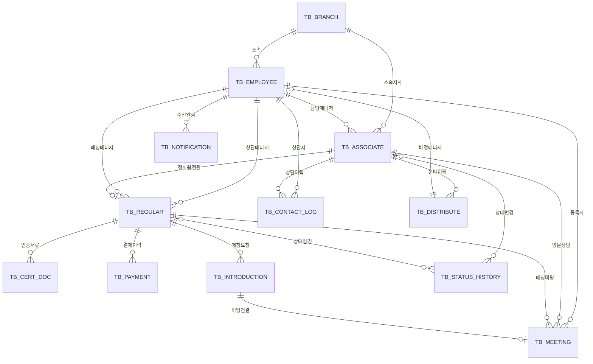

# 퍼플스 인트라넷 — DB 스키마 설계서

> 최종 수정: 2026-05-12 | 출처: ver01 analysis-data.js

---

## 1. ERD (Entity Relationship Diagram)

---

## 2. 테이블 상세 정의

### 2.1 TB_ASSOCIATE (준회원 마스터)

| 컬럼명 | 타입 | PK | 설명 |
|--------|------|:--:|------|
| assoc_id | INT | ✅ | 준회원 PK |
| name | VARCHAR(30) | | 이름 |
| phone | VARCHAR(15) | | 휴대폰 (UK, 중복체크 키) |
| gender | CHAR(1) | | 성별 (M/F) |
| birth_date | DATE | | 생년월일 |
| education | VARCHAR(20) | | 최종학력 |
| school | VARCHAR(50) | | 출신학교 |
| job | VARCHAR(30) | | 직업 |
| company | VARCHAR(50) | | 직장명 |
| region | VARCHAR(20) | | 거주지역 |
| marital_status | VARCHAR(10) | | 혼인상태 (초혼/재혼) |
| status | VARCHAR(30) | | 상태 (컨텍전, 부재중 등) |
| channel | VARCHAR(50) | | 유입경로 (마케팅채널) |
| branch_id | INT | | 소속지사 FK |
| consultant_id | INT | | 담당매니저 FK |
| dist_date | DATETIME | | 분배일시 |
| regist_date | DATETIME | | DB등록일 |
| last_contact | DATETIME | | 최근컨텍일 |
| created_at | DATETIME | | 생성일시 |
| updated_at | DATETIME | | 수정일시 |

### 2.2 TB_REGULAR (정회원 마스터)

| 컬럼명 | 타입 | PK | 설명 |
|--------|------|:--:|------|
| regular_id | INT | ✅ | 정회원 PK |
| member_code | VARCHAR(10) | | 회원번호 (M26001) |
| assoc_id | INT | | 준회원 FK (전환 이력) |
| name | VARCHAR(30) | | 이름 |
| phone | VARCHAR(15) | | 휴대폰 |
| gender | CHAR(1) | | 성별 |
| birth_date | DATE | | 생년월일 |
| photo_url | VARCHAR(255) | | 프로필사진 URL |
| brand | VARCHAR(20) | | 브랜드 (퍼플스/디노블/르매리) |
| education | VARCHAR(20) | | 최종학력 |
| school | VARCHAR(50) | | 출신학교 |
| job | VARCHAR(30) | | 직업 |
| company | VARCHAR(50) | | 직장명 |
| region | VARCHAR(20) | | 거주지역 |
| religion | VARCHAR(10) | | 종교 |
| height | SMALLINT | | 키(cm) |
| marital_history | VARCHAR(10) | | 혼인이력 (초혼/재혼) |
| family_wealth | VARCHAR(20) | | 가족자산 |
| personal_wealth | VARCHAR(20) | | 개인자산 |
| program | VARCHAR(20) | | 프로그램 (전문직/정규 등) |
| contract_type | VARCHAR(10) | | 계약유형 (횟수/기간/인증) |
| status | VARCHAR(20) | | 활동상태 |
| consultant_id | INT | | 상담매니저 FK |
| matching_mgr_id | INT | | 매칭매니저 FK |
| join_date | DATE | | 가입일 (=전산생성일, Lock) |
| expiry_date | DATE | | 만료일 (자동계산) |
| meeting_count | INT | | 누적미팅수 |
| created_at | DATETIME | | 생성일시 |
| updated_at | DATETIME | | 수정일시 |

### 2.3 TB_EMPLOYEE (사원 마스터)

| 컬럼명 | 타입 | PK | 설명 |
|--------|------|:--:|------|
| emp_id | INT | ✅ | 사원 PK |
| name | VARCHAR(30) | | 사원명 |
| emp_code | VARCHAR(10) | | 사번 |
| role | VARCHAR(20) | | 역할 (상담/매칭/인포/CS) |
| branch_id | INT | | 소속지사 FK |
| phone | VARCHAR(15) | | 연락처 |
| email | VARCHAR(100) | | 이메일 |
| is_active | TINYINT | | 활성여부 (0/1) |
| created_at | DATETIME | | 생성일시 |

### 2.4 TB_CONTACT_LOG (컨텍 이력)

| 컬럼명 | 타입 | PK | 설명 |
|--------|------|:--:|------|
| log_id | BIGINT | ✅ | 이력 PK |
| assoc_id | INT | | 준회원 FK |
| emp_id | INT | | 상담자 FK |
| contact_type | VARCHAR(10) | | 방법 (통화/SMS/카톡/부재) |
| content | TEXT | | 상담내용 |
| result | VARCHAR(30) | | 결과상태 |
| contact_date | DATETIME | | 컨텍일시 |
| created_at | DATETIME | | 생성일시 |

### 2.5 TB_MEETING (미팅 관리)

| 컬럼명 | 타입 | PK | 설명 |
|--------|------|:--:|------|
| meeting_id | INT | ✅ | 미팅 PK |
| assoc_id | INT | | 준회원 FK (방문상담) |
| regular_id | INT | | 정회원 FK (매칭미팅) |
| intro_id | INT | | 소개장 FK |
| meeting_type | VARCHAR(10) | | 유형 (방문상담/매칭미팅) |
| meeting_date | DATETIME | | 미팅일시 |
| place | VARCHAR(100) | | 장소 |
| registrar_id | INT | | 등록자(매니저) FK |
| pre_confirm | VARCHAR(10) | | 사전확인 (확인완료/미확인) |
| feeling | TEXT | | 소감/느낌 |
| result | VARCHAR(10) | | 결과 (정상/펑크/취소/노쇼) |
| created_at | DATETIME | | 생성일시 |

### 2.6 TB_INTRODUCTION (소개장/매칭 요청)

| 컬럼명 | 타입 | PK | 설명 |
|--------|------|:--:|------|
| intro_id | INT | ✅ | 소개장 PK |
| requester_id | INT | | 요청회원 FK |
| target_id | INT | | 대상회원 FK |
| target_mgr_id | INT | | 대상회원 매니저 FK |
| profile_sent | TINYINT | | 프로필발송여부 |
| profile_sent_date | DATETIME | | 프로필발송일 |
| result | VARCHAR(10) | | 결과 (OK/거절/대기) |
| result_date | DATETIME | | 결과일 |
| created_at | DATETIME | | 등록일시 |

### 2.7 TB_PAYMENT (결제/가입비 관리)

| 컬럼명 | 타입 | PK | 설명 |
|--------|------|:--:|------|
| payment_id | INT | ✅ | 결제 PK |
| regular_id | INT | | 정회원 FK |
| payment_type | VARCHAR(10) | | 유형 (1가입/2가입/추가) |
| program | VARCHAR(20) | | 프로그램 |
| amount | INT | | 결제금액 |
| paid_amount | INT | | 납부금액 |
| unpaid_amount | INT | | 미수금 |
| pay_method | VARCHAR(10) | | 결제수단 (카드/현금/이체) |
| pay_date | DATE | | 결제일 |
| receipt_no | VARCHAR(30) | | 영수증번호 |
| created_at | DATETIME | | 생성일시 |

### 2.8 TB_CERT_DOC (인증서류 관리)

| 컬럼명 | 타입 | PK | 설명 |
|--------|------|:--:|------|
| cert_id | INT | ✅ | 인증 PK |
| regular_id | INT | | 정회원 FK |
| doc_name | VARCHAR(50) | | 서류명 |
| status | VARCHAR(10) | | 상태 (미등록/등록완료) |
| method | VARCHAR(10) | | 등록방법 (직접/자동스크래핑) |
| issue_date | DATE | | 발급일자 |
| issuer | VARCHAR(50) | | 발급처 |
| file_url | VARCHAR(255) | | 파일저장경로 (S3) |
| file_name | VARCHAR(100) | | 원본파일명 |
| registered_by | INT | | 등록자 FK |
| created_at | DATETIME | | 등록일시 |

### 2.9 TB_STATUS_HISTORY (상태변경 이력/Audit Log)

| 컬럼명 | 타입 | PK | 설명 |
|--------|------|:--:|------|
| history_id | BIGINT | ✅ | 이력 PK |
| target_type | VARCHAR(10) | | 대상구분 (준회원/정회원) |
| target_id | INT | | 대상 PK |
| prev_status | VARCHAR(30) | | 이전상태 |
| new_status | VARCHAR(30) | | 변경상태 |
| reason | VARCHAR(200) | | 변경사유 |
| processor_id | INT | | 처리자 FK |
| changed_at | DATETIME | | 변경일시 |

### 2.10 TB_DISTRIBUTE (회원분배 이력)

| 컬럼명 | 타입 | PK | 설명 |
|--------|------|:--:|------|
| dist_id | INT | ✅ | 분배 PK |
| assoc_id | INT | | 준회원 FK |
| emp_id | INT | | 배정매니저 FK |
| dist_type | VARCHAR(10) | | 분배유형 (자동/수동) |
| is_duplicate | TINYINT | | 중복DB여부 (0/1) |
| dup_original_id | INT | | 원본회원 FK (중복시) |
| dist_date | DATETIME | | 분배일시 |
| created_at | DATETIME | | 생성일시 |

### 2.11 TB_NOTIFICATION (알림 발송 이력)

| 컬럼명 | 타입 | PK | 설명 |
|--------|------|:--:|------|
| noti_id | BIGINT | ✅ | 알림 PK |
| recipient_type | VARCHAR(10) | | 수신대상 (매니저/회원) |
| recipient_id | INT | | 수신자 PK |
| channel | VARCHAR(10) | | 발송채널 (카카오/SMS) |
| template | VARCHAR(50) | | 알림 템플릿코드 |
| title | VARCHAR(100) | | 알림제목 |
| content | TEXT | | 알림내용 |
| status | VARCHAR(10) | | 발송상태 (대기/성공/실패) |
| sent_at | DATETIME | | 발송일시 |
| created_at | DATETIME | | 생성일시 |

### 2.12 TB_BRANCH (지사 마스터)

| 컬럼명 | 타입 | PK | 설명 |
|--------|------|:--:|------|
| branch_id | INT | ✅ | 지사 PK |
| name | VARCHAR(30) | | 지사명 |
| address | VARCHAR(200) | | 주소 |
| tel | VARCHAR(15) | | 대표전화 |
| is_active | TINYINT | | 활성여부 |
