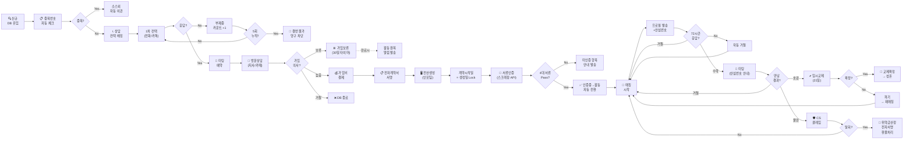
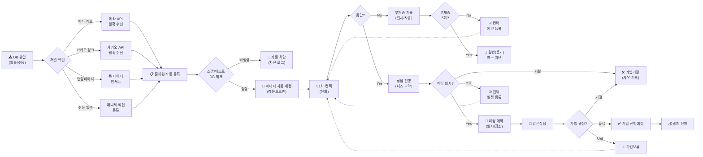
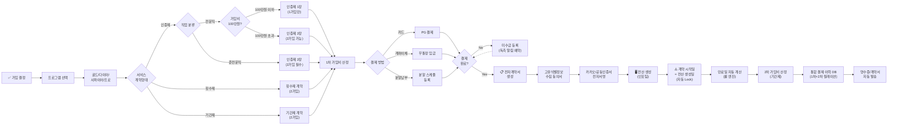
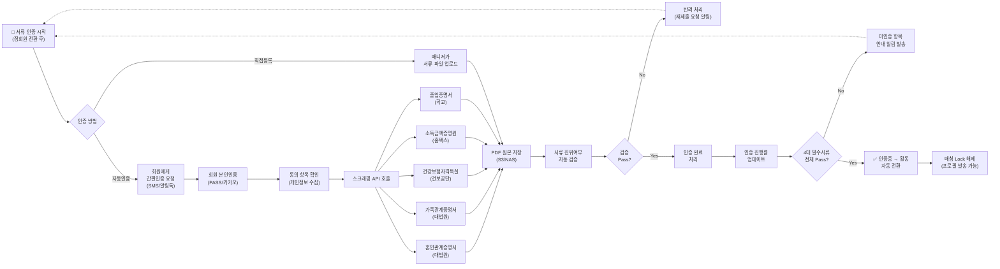
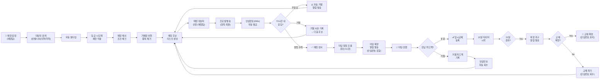
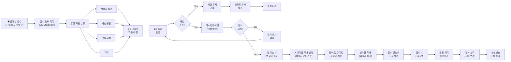
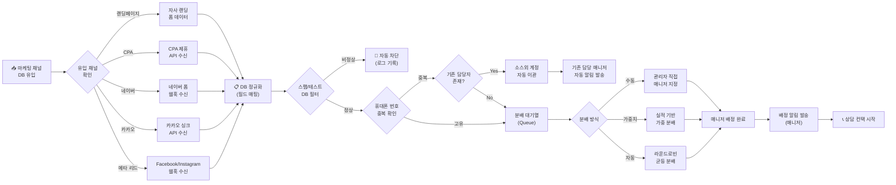
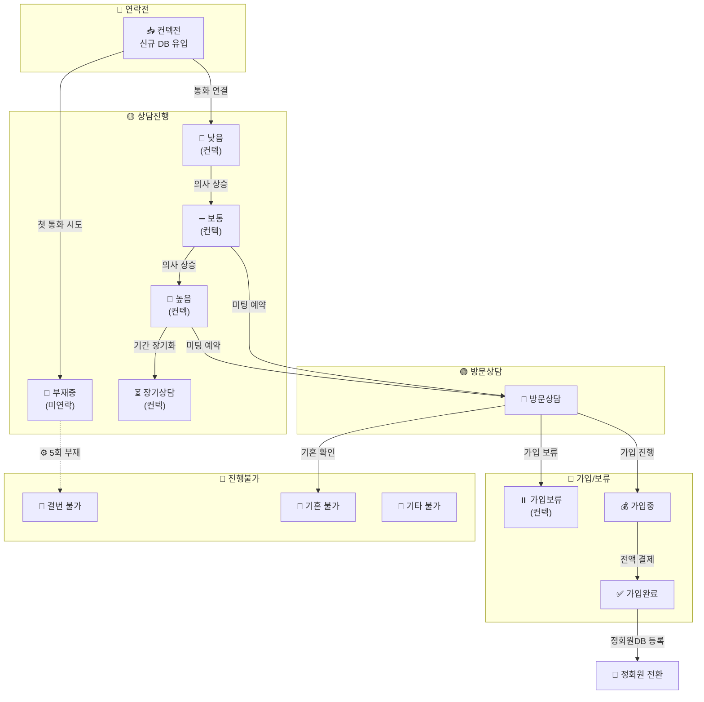
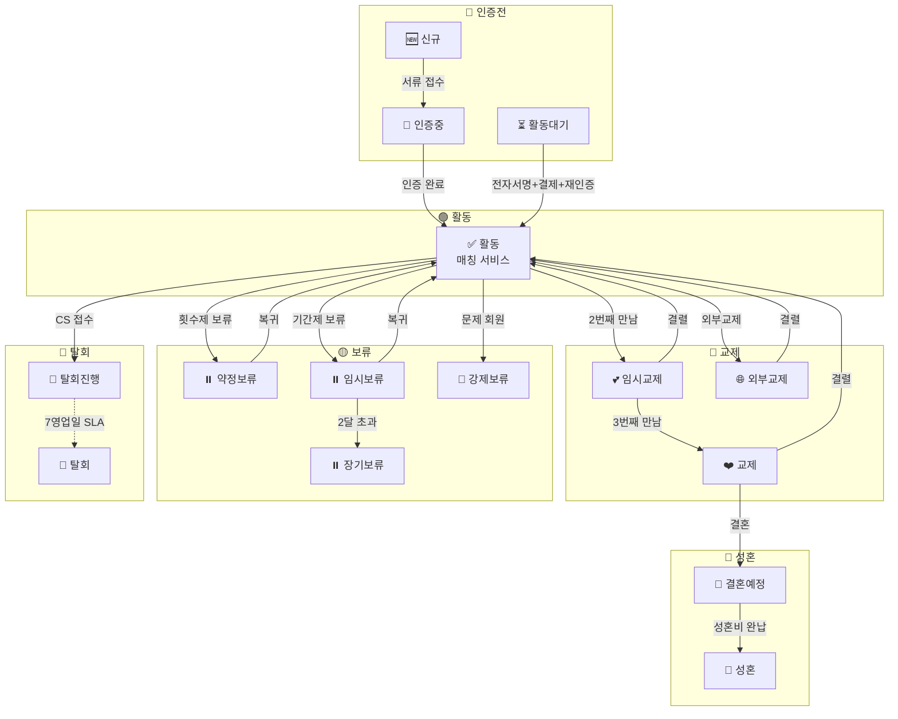
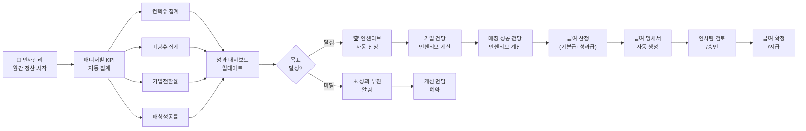

# 퍼플스 인트라넷 — 업무 플로우차트

> 최종 수정: 2026-05-12 | 출처: ver01 analysis-data.js

---

## 1. 전체 업무 메인 플로우

---

## 2. 준회원 가입 플로우

---

## 3. 결제/계약 플로우

---

## 4. 서류 인증 플로우

---

## 5. 매칭 플로우

---

## 6. CS/클레임 플로우

---

## 7. 유입DB 분배 플로우

---

## 8. 준회원 상태 전이도

---

## 9. 정회원 상태 전이도

---

## 10. 인사/성과 관리 플로우

