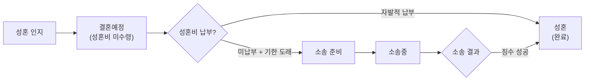

# 정회원 운영 정책서

> **작성일**: 2026-06-16  
> **출처**: 260616 매칭·전략 정책회의 (참석: 전략팀장, 매칭팀장, 센터장)  
> **관련 문서**: PRD_정회원관리.md, PRD_계약탈회환불.md, RBAC_권한관리.md, PRD_트리니티관리.md

---

## 1. 회원정보 수정 권한 정책

### 1.1 권한 체계 (조회 / 등록 / 수정 / 삭제)

#### 기본정보 (이름, 연락처, 키, 생년월일, 학력, 직업 등)

| 부서(팀) | 조회 | 등록 | 수정 | 삭제 | 비고 |
|----------|:----:|:----:|:----:|:----:|------|
| **매칭팀** | ✅ | ❌ | ❌ | ❌ | 수정 필요 시 인증팀에 요청 |
| **상담팀** | ✅ | ❌ | ❌ | ❌ | 조회만 가능 |
| **인증팀** | ✅ | ✅ | ✅ | ❌ | 1차 수정 권한자 |
| **영업팀** | ✅ | ❌ | ❌ | ❌ | 조회만 가능 |
| **재무팀** | ❌ | ❌ | ❌ | ❌ | 접근 불필요 |
| **경영팀** | ✅ | ❌ | ❌ | ❌ | 열람 전용 |
| **홍보마케팅** | ❌ | ❌ | ❌ | ❌ | 접근 불필요 |
| **고객만족실** | ✅ | ❌ | ❌ | ❌ | CS 확인용 조회 |
| **법무팀** | ✅ | ❌ | ❌ | ❌ | 소송/블랙리스트 확인용 |
| **전략기획팀** | ✅ | ❌ | ❌ | ❌ | 정책 검토용 |
| **최고관리자** | ✅ | ✅ | ✅ | ❌ | 인증팀 부재 시 |
| **시스템관리자** | ✅ | ✅ | ✅ | ✅ | 전체 권한 |

#### 메모 / 특이사항

| 부서(팀) | 조회 | 등록 | 수정 | 삭제 | 비고 |
|----------|:----:|:----:|:----:|:----:|------|
| **매칭팀** | ✅ | ✅ | 본인만 | ❌ | 타인 등록 건 수정 불가 |
| **상담팀** | ✅ | ✅ | 본인만 | ❌ | 타인 등록 건 수정 불가 |
| **인증팀** | ✅ | ✅ | ✅ | ❌ | |
| **영업팀** | ✅ | ✅ | 본인만 | ❌ | |
| **재무팀** | ❌ | ❌ | ❌ | ❌ | |
| **경영팀** | ✅ | ❌ | ❌ | ❌ | 열람 전용 |
| **홍보마케팅** | ❌ | ❌ | ❌ | ❌ | |
| **고객만족실** | ✅ | ✅ | 본인만 | ❌ | CS 상담 기록용 |
| **법무팀** | ✅ | ✅ | 본인만 | ❌ | 법무 메모 등록 |
| **전략기획팀** | ✅ | ❌ | ❌ | ❌ | 열람 전용 |
| **최고관리자** | ✅ | ✅ | ✅ | ❌ | |
| **시스템관리자** | ✅ | ✅ | ✅ | ✅ | |

#### 계약정보 (프로그램, 가입비, 성혼비, 만료일 등)

| 부서(팀) | 조회 | 등록 | 수정 | 삭제 | 비고 |
|----------|:----:|:----:|:----:|:----:|------|
| **매칭팀** | ✅ | ❌ | ❌ | ❌ | |
| **상담팀** | 👁️ | ❌ | ❌ | ❌ | 본인 담당 회원만 |
| **인증팀** | ✅ | ✅ | ✅ | ❌ | |
| **영업팀** | ✅ | ✅ | ❌ | ❌ | 매출 입력 가능 |
| **재무팀** | ✅ | ❌ | ✅ | ❌ | 매출 금액 수정 |
| **경영팀** | ✅ | ❌ | ❌ | ❌ | 열람 전용 |
| **홍보마케팅** | ❌ | ❌ | ❌ | ❌ | |
| **고객만족실** | ✅ | ❌ | ❌ | ❌ | 탈회 심사용 조회 |
| **법무팀** | ✅ | ❌ | ❌ | ❌ | 소송 심사용 조회 |
| **전략기획팀** | ✅ | ❌ | ❌ | ❌ | |
| **최고관리자** | ✅ | ✅ | ✅ | ❌ | |
| **시스템관리자** | ✅ | ✅ | ✅ | ❌ | 삭제 불가 (감사 보존) |

#### 상태 변경

| 부서(팀) | 조회 | 수정 | 비고 |
|----------|:----:|:----:|------|
| **매칭팀** | ✅ | 일부만 | 교제, 약정보류, 임시보류 등 |
| **상담팀** | ✅ | ❌ | |
| **인증팀** | ✅ | ✅ | 전체 상태 변경 가능 |
| **영업팀** | ✅ | ❌ | |
| **재무팀** | ❌ | ❌ | |
| **경영팀** | ✅ | ❌ | |
| **홍보마케팅** | ❌ | ❌ | |
| **고객만족실** | ✅ | 일부만 | 탈회진행, 임시보류, 장기보류 |
| **법무팀** | ✅ | 일부만 | 소송중, 블랙리스트 |
| **전략기획팀** | ✅ | ❌ | |
| **최고관리자** | ✅ | ✅ | 강제보류, 탈회 최종 결재 |
| **시스템관리자** | ✅ | ✅ | 전체 |

#### 매칭정보 (소개장, 미팅, 안심번호)

| 부서(팀) | 조회 | 등록 | 수정 | 삭제 | 비고 |
|----------|:----:|:----:|:----:|:----:|------|
| **매칭팀** | ✅ | ✅ | ✅ | ❌ | 핵심 업무 영역 |
| **상담팀** | ❌ | ❌ | ❌ | ❌ | 접근 불가 |
| **인증팀** | ✅ | ❌ | ❌ | ❌ | 조회만 |
| **영업팀** | ❌ | ❌ | ❌ | ❌ | |
| **재무팀** | ❌ | ❌ | ❌ | ❌ | |
| **경영팀** | ✅ | ❌ | ❌ | ❌ | 열람 전용 |
| **홍보마케팅** | ❌ | ❌ | ❌ | ❌ | |
| **고객만족실** | ✅ | ❌ | ❌ | ❌ | 클레임 확인용 조회 |
| **법무팀** | ✅ | ❌ | ❌ | ❌ | 소송 확인용 |
| **전략기획팀** | ❌ | ❌ | ❌ | ❌ | |
| **최고관리자** | ✅ | ✅ | ✅ | ❌ | |
| **시스템관리자** | ✅ | ✅ | ✅ | ✅ | |

> **범례**: ✅ 가능 | ❌ 불가 | 👁️ 본인 담당 건만 조회 | 본인만 = 본인이 등록한 건만 수정 가능

### 1.3 변경이력 시각화 요구사항 (신규)

> [!TIP]
> 회의에서 강조된 핵심 기능 — **최근 수정된 정보의 시각적 표시**

| 항목 | 설명 |
|------|------|
| **표시 방식** | 최근 수정된 필드의 셀에 색상 테두리 또는 배경색 적용 |
| **표시 기간** | 수정 후 약 **1개월** 동안 유지 |
| **목적** | 매니저가 변경된 정보를 즉시 인지 → 연관 정보(프로필 등) 동기화 가능 |
| **예시** | 직업이 변경됨 → 직업 셀 하이라이트 → 매니저가 프로필 소개문의 직업 정보도 수정 |

**문제 사례:**
- 키 정보: 회원이 올리고 → 상담이 또 올리고 → 매칭이 또 올림 → 실제 키와 **10cm 차이** 발생
- 직업 변경: 전산 직업만 수정하고 프로필 소개문 직업은 미수정 → 불일치

**변경이력 추적 범위:**

| 구분 | 현재 상태 | 개선 방향 |
|------|----------|----------|
| 특정 정보 (상태, 매니저 등) | ✅ 변경 기록 남음 | 유지 |
| 일반 정보 (학교, 연봉, 키 등) | ❌ 누가 언제 수정했는지 알 수 없음 | ✅ 전체 필드 변경이력 추적 |

---

## 2. 회원 상태 관리 정책

### 2.1 보류 상태 상세 정책

| 상태 | 기간 중단 | 기간 제한 | 서류 필요 | 자동 전환 | 트리거 |
|------|:--------:|:--------:|:--------:|:--------:|--------|
| **임시보류** | ❌ 중단 안됨 | 없음 (무기한) | 불필요 | ❌ 수동만 | 회원 요청 또는 매니저 판단 |
| **약정보류** | ❌ 중단 안됨 | 없음 (무기한) | 불필요 | ❌ 수동만 | 회원 요청 (횟수제) |
| **장기보류** | ✅ **3개월까지만** | 없음 (수동 해제) | ✅ 서류 필요 | ❌ 수동만 | 회원 요청 + 서류 제출 |
| **강제보류** | - | 무기한 | - | ❌ 관리자만 | 회장님 결재 |

> [!WARNING]
> **자동 상태 전환은 전면 금지** — 모든 보류 해제/상태 변경은 수동으로만 처리.  
> 자동 전환 시 탈회 언급 회원에게 의도치 않은 컨택이 발생할 수 있어 **클레임 위험**이 매우 높음.

**임시보류 운영 실태:**
- 매니저가 관리 어려운 회원을 임시보류로 걸어놓는 경우 존재
- 매니저 퇴사 시 후임이 히스토리를 파악 못함 → 수년간 방치 사례 발생
- 회원이 "한 번도 연락 안 왔다"는 클레임 유발

**개선 방향:**
- 보류 설정 시 **사유 필수 기록** (메모장/상담이력)
- 보류 경과 일수 표시 → 매니저에게 알림 (자동 발송은 아님, 전산에서 확인 가능하도록)
- 컨택 예약 날짜 설정 기능 → 해당 날짜에 매니저에게 업무 알림

### 2.2 탈회 관련 상태 정의

| 상태 | 설명 | 현행 | 개선 |
|------|------|:----:|:----:|
| **활동** | 탈회 언급 전 | ✅ | ✅ |
| **(신규 필요) 탈회 검토중** | 탈회 언급 → 탈회금 확정 전 | ❌ 없음 | ✅ 신설 필요 |
| **탈회진행** | 탈회금 확정 + 통보 완료 | ✅ | ✅ |
| **탈회** | 탈회금 전액 지급 완료 | ✅ | ✅ |

> [!IMPORTANT]
> **"탈회 검토중" 상태 신설 필요** — 회원이 탈회를 언급했으나 탈회금이 아직 확정되지 않은 상태. 소보원 진행, 소송 진행 등의 기간이 길어질 수 있으므로 별도 상태값 필요.

### 2.3 탈회 접수 차단 상태

기존 PRD 정의 + 회의에서 추가 확인된 항목:

| 차단 상태 | 사유 |
|----------|------|
| 활동대기 | 활성 서비스 미진행 |
| 만료(기간만료) | 이미 서비스 종료 |
| 자동만료 | 시스템 자동 만료 완료 |
| 약정만료 | 횟수 소진 완료 |
| 탈회 / 탈회진행 | 이미 탈회 접수 또는 완료 |
| **결혼예정** | 성혼비 대상자 — 탈회 사유 불합리 |
| **성혼** | 이미 성혼 완료 |
| **소송중** | 법적 분쟁 진행 중 |
| **리콜** | 리콜 대기 상태 |

---

## 3. 프로필 발송 정책

### 3.1 상태별 프로필 발송 가능 여부

| 상태 | 발송 가능 | 비고 |
|------|:---------:|------|
| 신규 | ❌ | |
| 인증중 | ❌ | |
| 활동대기 | ❌ | |
| **활동** | ✅ | 정상 발송 |
| **임시교제** | ✅ | 한쪽만 걸린 경우 상대방은 발송 가능 |
| **교제** | ❌ | 쌍방 Lock — 타 회원 발송 차단 |
| **외부교제** | ❌ | |
| **임시보류** | ✅ | 보류 중이나 프로필 수신 가능 (활동 복귀 유도용) |
| **약정보류** | ✅ | 동일 |
| **장기보류** | ❌ | |
| **강제보류** | ❌ | |
| **소송중** | ❌ | 프로필 URL 무효화 + 전면 차단 |
| 만료 계열 | ❌ | |
| 결혼예정 / 성혼 | ❌ | |

> [!IMPORTANT]
> **만료일 경과 시 프로필 발송 차단** — 매니저가 만료를 치지 않고 활동 상태로 두는 경우가 있으나(후기 등록 등), **2가입 만료일자 경과 시** 프로필 발송 및 만남 등록을 시스템에서 차단해야 함.

### 3.2 프로필 응답 처리 (기존 대비 변경)

| 항목 | 기존 (PRD) | 회의 결정 |
|------|-----------|----------|
| 72시간 무응답 | 자동 거절 처리 | **"거절" 대신 "미응답/응답지연"으로 상태 변경** |
| 거절 처리 | 거절로 확정 | **거절 확정하지 않음** — 추후 재발송 가능성 유지 |
| 해외 회원 | 동일 72시간 | 시차 고려, 기간 유연화 검토 |

> [!NOTE]
> 향후 매칭 어플 도입 시: 프로필 열람 기간 제한 (3~5일) → 만료 시 재발송 요청 버튼 → 회원이 직접 재발송 요청 가능

---

## 4. 계약/업그레이드 정책

### 4.1 계약 형태 구분

| 구분 | 1가입 | 비고 |
|------|:-----:|------|
| **정규 프로그램** (골드, 플래티넘 등) | 무조건 횟수제 | 1가입은 기간제 불가 |
| **전문직 (55만↓)** | 기간제 1장 | 업그레이드 불가 |
| **전문직 (100만↑)** | 횟수제 또는 기간제 선택 가능 | 2장 계약 가능 |
| **한시적 프로모션** | 기간제 1장 가능 | 업그레이드 불가 |

### 4.2 업그레이드/다운그레이드

| 시점 | 처리 방식 | 셰어 |
|------|----------|:----:|
| **인증 전** | 기존 계약 취소 + 신규 계약서 재작성 | - |
| **인증 후** | 전산 내 업그레이드 기능 (차액 결제) | ❌ 없음 |
| **전자계약서 도입 후** | 인증 후에도 전자 계약서 신규 생성 가능 | ❌ 없음 |

> **업그레이드 불가 대상**: 기간제 1장 계약 (전문직 55만↓, 파티, 한시적 프로모션)

### 4.3 가입비 정책

| 항목 | 현행 | 개선 방향 |
|------|------|----------|
| 금액 입력 | 수동으로 하나하나 입력 | 프로그램+할인율 선택 → **자동 금액 계산** + 수동 수정 가능 |
| 할인율 | 매니저 재량 (영업적 유연성) | 시스템 할인율 제한 ❌ → **영업 자율** 유지 |
| 금액 절삭/올림 | 100원/1000원 단위 조정 | 자동 계산 후 **수동 수정 허용** (올림/절삭) |
| 비정상 할인 | 인증팀에서 사후 확인 → 돌려보내기 | 유지 |

---

## 5. 성혼 관리 정책

### 5.1 성혼 인지 경로

| 경로 | 설명 |
|------|------|
| **회원 통보** | 회원이 직접 결혼 예정 알림 |
| **매니저 발견** | 매칭 매니저가 회원 상태 확인 중 파악 |
| **법무팀 서류** | 혼인관계증명서 발급을 통한 확인 |

### 5.2 상태 전이



### 5.3 소송 관리 특이사항

- 소송은 **분산 제출** — 한 번에 다수 건을 법원에 접수하지 않음 (중앙지검 집중 방지)
- 매출액 고려하여 소송 시기 조절 (법무팀 재량)
- 소송중 상태 → **프로필 전면 차단**

---

## 6. 안심번호 정책

### 6.1 현행 이슈

| 이슈 | 내용 |
|------|------|
| **금요일 마감** | 금요일 오전 이후 안심번호 자동 등록 마감 → 오후 등록 건은 전산팀 수동 발급 필요 |
| **세트 발급** | 양쪽 회원에게 쌍으로 발급 — 한쪽 오류 시 양쪽 모두 미발급 |
| **부모 진행** | 연락 번호가 본인이 아닌 경우 (부모 진행) 안심번호 발급 불가 |
| **휴일 발송** | D-1이 토/일/공휴일인 경우 직전 영업일로 자동 이동 필요 |

### 6.2 개선 방향

- 금요일 마감 제한 해소
- 부모 진행 회원 안심번호 발급 방안 검토
- 휴일 자동 이동 로직 구현 (PRD_정회원관리.md §6.3 참조)

---

## 7. 트리니티 회원 정책 (보완)

### 7.1 자동 등록 (회의 확정)

| 항목 | 현행 | 개선 |
|------|------|------|
| 등록 트리거 | 인포 수동 버튼 클릭 | **다이아몬드 이상 가입 시 자동 등록** |
| 누락 문제 | 인포 발송 누락 → 리스트 미등록 | 자동화로 해소 |

---

## 8. 전산 생성 통합 정책 (최우선 과제)

### 8.1 현행 문제

> [!CAUTION]
> **현재 가장 큰 구조적 문제** — 1가입 약정만료 시 별도 전산이 생성되어, 한 사람의 데이터가 **최대 5건 이상** 리스트에 중복 표시됨.

| 문제 | 설명 |
|------|------|
| 전산 중복 | 약정만료 → 활동대기 전산 생성 → 2가입 활동 전산 생성 → 동일인 다수 행 |
| 활동 회원수 불일치 | 리스트 회원 수 ≠ 실제 활동 회원 수 |
| 히스토리 단절 | 전산 간 이력 연결 불가 |
| 관리 불가 | 매니저/관리자 혼란 |

### 8.2 개선 방향

```
[현행] 약정만료 치기 → 새 전산 생성 (별도 행)
[목표] 하나의 아이디(전산) 안에서 1가입/2가입을 릴레이션으로 관리
       약정만료 → 동일 전산 내 상태 전환 + 2가입 정보 입력 화면 자동 표시
```

> 기존 회원 데이터 통합은 마이그레이션 작업이 필요하며, 신규 가입자부터 단계적 적용 권장.

---

## 9. 알림/자동화 정책 가이드라인

### 9.1 원칙

| 구분 | 자동 가능 | 자동 불가 (수동만) | 사유 |
|------|:---------:|:----------------:|------|
| 트리니티 등록 | ✅ | | 누락 방지 |
| 만료일 도래 알림 (매니저) | ✅ | | 업무 리마인드 |
| 보류 경과 알림 (매니저) | ✅ | | 업무 리마인드 |
| 컨택 예약 알림 (매니저) | ✅ | | 업무 리마인드 |
| **상태 자동 전환** | | ❌ | 케이스바이케이스, 클레임 위험 |
| **회원 대상 알림톡 자동 발송** | | ❌ | 탈회 언급 회원 등 민감 케이스 존재 |
| **보류 자동 해제** | | ❌ | 무기한 보류 사유 다양 |
| **만료 자동 처리** | | ❌ | 후기 등록 등 후속 작업 필요 |

### 9.2 매니저 업무 캘린더 연동

- 보류 설정 시 **컨택 예약 날짜** 입력 가능
- 해당 날짜에 매니저에게 **업무 알림** 표시
- 회원에게 직접 자동 발송은 하지 않음 → 매니저가 판단 후 수동 발송

---

## 10. 향후 검토 과제

| No | 항목 | 내용 | 우선순위 | 관련 회의 발언 |
|----|------|------|:--------:|--------------|
| 1 | **전산 통합 (1인 1전산)** | 약정만료 시 별도 전산 생성 → 단일 전산 내 릴레이션 관리 | 🔴 최우선 | "이게 제일 큰 문제" |
| 2 | **변경이력 시각화** | 최근 수정 필드 하이라이트 (1개월간) | 🔴 높음 | "색깔로 테두리 쳐지거나" |
| 3 | **탈회 검토중 상태 신설** | 탈회 언급 ~ 탈회금 확정 사이 중간 상태 | 🟡 중간 | "소보원 걸리면 기간 길어져" |
| 4 | **프로필 응답 상태 개선** | 거절 → 미응답/응답지연으로 변경 | 🟡 중간 | "거절 처리하면 업무적으로 좀" |
| 5 | **만료일 경과 시 발송/만남 차단** | 2가입 만료일 경과 → 프로필·만남 Lock | 🟡 중간 | "만료일 지나면 만남 등록 안 되게" |
| 6 | **매칭 어플 (장기)** | 회원 직접 상태 관리, 프로필 열람, 재발송 요청 | 🔵 장기 | "매칭 관리 어플이 큰 꿈" |
| 7 | **결제 자동 계산** | 프로그램+할인율 → 자동 금액 + 수동 수정 | 🟡 중간 | "자동 금액 뜨는데 수정 가능하게" |
| 8 | **전자계약서 (1가입)** | 모두싸인 등 연동, 1가입도 전자 계약서 도입 | 🟡 중간 | "1가입도 전자 계약서로" |
| 9 | **안심번호 개선** | 금요일 마감·부모진행 이슈 해소 | 🟡 중간 | "되게 불편한 부분" |
| 10 | **영수증/결제 확인 개선** | 계좌이체 입금확인 자동화, 영수증 자동 발급 | 🔵 장기 | "결제 부분은 나중에 확 잡고" |

---

## 부록: 회의 핵심 결정 요약

| # | 결정 사항 | 합의 수준 |
|---|----------|:---------:|
| 1 | 기본정보 수정은 인증팀 주도, 전략팀장·센터장은 보조 권한 | ✅ 확정 |
| 2 | 모든 상태 전환은 수동만 허용 (자동 전환 금지) | ✅ 확정 |
| 3 | 회원 대상 자동 알림톡 발송 금지 (매니저 알림만 가능) | ✅ 확정 |
| 4 | 임시보류·약정보류 시에도 프로필 발송 가능 | ✅ 확정 |
| 5 | 교제·장기보류·강제보류·소송중 시 프로필 발송 불가 | ✅ 확정 |
| 6 | 업그레이드 셰어 없음 (주 매니저 단독) | ✅ 확정 |
| 7 | 트리니티 등록은 자동화 진행 | ✅ 확정 |
| 8 | 거절 대신 미응답/응답지연 상태 사용 | ✅ 확정 |
| 9 | 전산 통합(1인 1전산)은 최우선 과제이나 마이그레이션 난이도 높음 | ⚠️ 방향 합의 |
| 10 | 매칭 어플은 인트라넷 완성 후 장기 과제로 | ⚠️ 방향 합의 |
